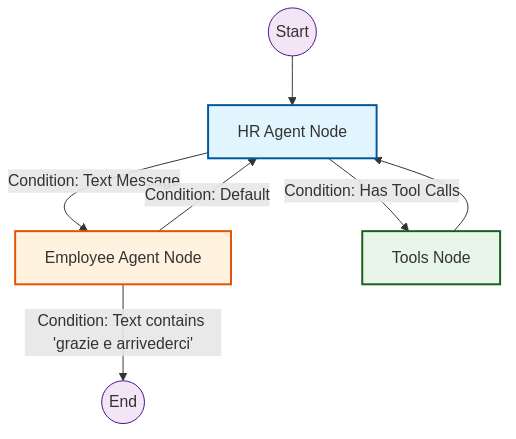
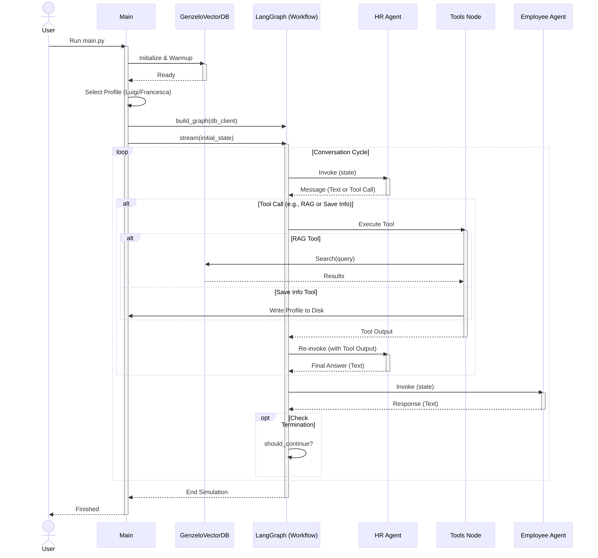

# GenZ & Millennials HR Onboarding Simulation

This project implements an intelligent multi-agent simulation for HR onboarding, designed to explore and replicate the
behavioral nuances of **Gen Z** and **Millennial** employees.

The core innovation lies in the data-driven "persona" generation: employee agents are not just generic LLMs, but are
grounded in **real sociometric data** extracted from the **SimBench** dataset.

## 🧠 Data-Driven Behavior (SimBench)

The behavioral rules for our agents are not hallucinated. They are rigorously extracted from the **SimBench dataset
** ([arXiv:2510.17516](https://arxiv.org/pdf/2510.17516)).

### The Pipeline

1. **Source Data**: We utilize the SimBench survey data, which covers diverse topics like labor attitudes, digital
   behavior, and civic engagement across European countries (2016-2020).
2. **LLM Extraction**: An automated pipeline (`extraction_and_create_kb.ipynb`) processes this raw data. It uses a
   specialized prompt (`prompts/kb_prompt.py`) to extract **concrete behavioral patterns** and sociometric insights.
3. **Knowledge Base**: These insights are stored in structured JSON files in the `data/` directory:
    * `data/genz.json`: Insights on Gen Z (e.g., pragmatic institutionalism, digital normativity).
    * `data/millenials.json`: Insights on Millennials (e.g., economic resilience, portfolio careers).

These JSON files serve as the "brain" for our simulation, ensuring agents act according to verified generational trends.

## 🤖 Agent Architecture

The application simulates a conversation between an HR Manager and a new Employee.

### 1. Employee Agent (The Persona)

The employee agent's personality is **dynamically constructed**. When a profile is selected (e.g., "Luigi, Gen Z, Italy"
or "Francesca, Millennial, Italy"):

* The system loads specific behavioral rules from the `data/` folder.
* These rules are injected into the System Prompt (`prompts/luigi_prompt.py`, `prompts/francesca_prompt.py`), forcing
  the LLM to adopt the specific stances, communication styles, and values of that generation and region.

### 2. HR Agent (The Interviewer)

The HR agent ("Alex") is equipped with a **RAG (Retrieval-Augmented Generation)** tool.

* **Goal**: To assess the candidate's fit and onboarding needs.
* **Tool Use**: The HR agent queries the Vector Database (containing the SimBench insights) to understand the *typical*
  behaviors of the candidate's generation.
* **Strategy**: It uses this retrieved context to ask targeted, psychologically relevant questions (e.g., asking a Gen Z
  candidate about their views on "work-life blurring" because the data suggests this is a key trait).

## 📊 System Visualizations

### Agent Interaction Graph

This graph illustrates the control flow between the HR Agent, the Employee Agent, and the Tool execution node (
LangGraph).



### Simulation Sequence Diagram

A detailed view of the lifecycle: from initialization and vector DB warmup to the conversation loop and final profile
generation.



## 🚀 Usage

### Prerequisites

* Python >=3.11, <=3.12
* `uv` (for dependency management)

### Installation

```bash
uv sync
```

### Running the Simulation

You can run the simulation and select a profile interactively or via flags.

```bash
# Interactive mode
uv run main.py

# Direct profile selection
uv run main.py --profile Luigi
uv run main.py --profile Francesca
```

## 📂 Project Structure

* `data/`: Contains the extracted SimBench behavioral knowledge bases (`genz.json`, `millenials.json`).
* `agents/`: Implementation of `hr_agent` and `employee_agent`.
* `prompts/`: System prompts and the extraction logic (`kb_prompt.py`).
* `tools/`: RAG implementation (`rag_tool.py`) and profile saver.
* `vector_db/`: ChromaDB wrapper for semantic search over the behavioral data.
* `extraction_and_create_kb.ipynb`: The notebook used to generate the knowledge base from raw data.
* `documents/`: Documentation assets and diagrams.
